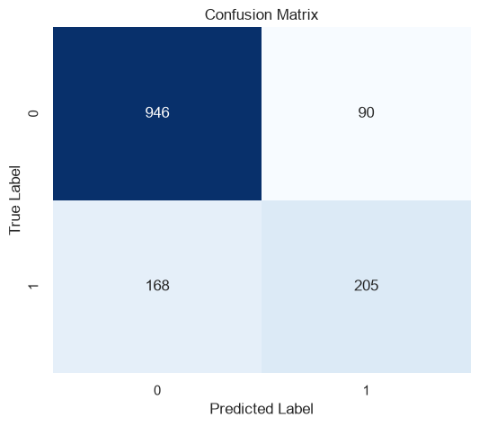
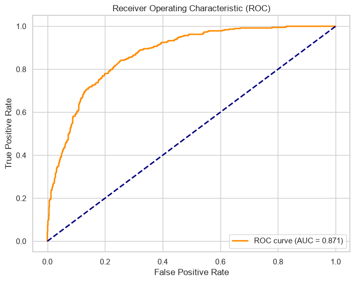
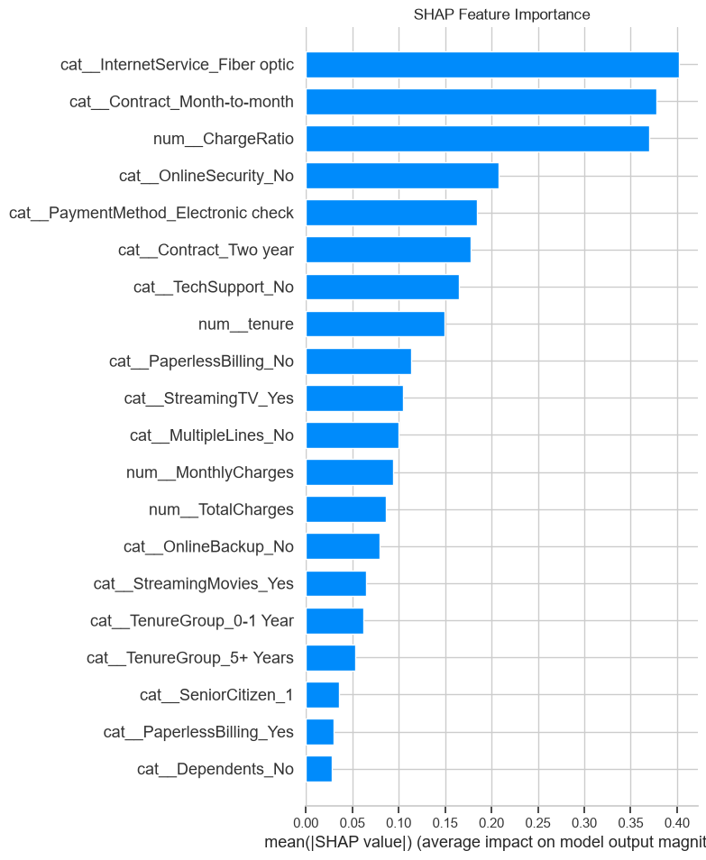
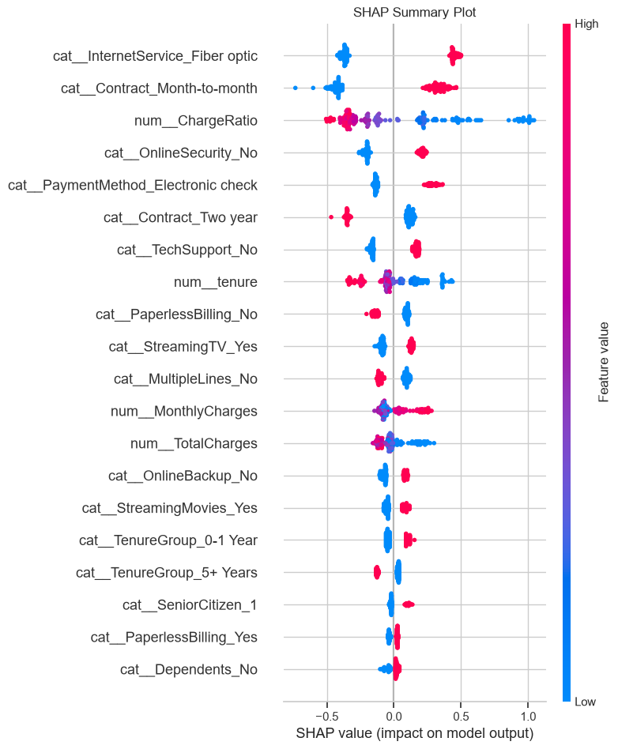

# Customer Churn Prediction Platform

Una plataforma integral que combina el poder predictivo del **Machine Learning** con una **arquitectura Backend robusta**, diseñada para identificar clientes en riesgo de abandono (*Customer Churn*). El proyecto implementa un flujo **end-to-end**, desde el entrenamiento del modelo hasta su despliegue como una API REST y un Dashboard  para entender el entrenamiento del modelo.

---

#  Propuesta de Valor

Este proyecto demuestra conocimientos de desarrollo de software y Machine Learning orientados a producción mediante:

* **Backend con Clean Architecture:** separación de responsabilidades mediante capas de Rutas, Servicios y Repositorios.
* **Machine Learning End-to-End:** entrenamiento, serialización y despliegue de un modelo predictivo para estimar la probabilidad de abandono de clientes.
* **Explainable AI (XAI):** integración de SHAP para interpretar tanto predicciones individuales como el comportamiento global del modelo.
* **Persistencia de predicciones:** almacenamiento de resultados para auditoría y análisis posterior.
* **Contenerización:** despliegue completo mediante Docker y Docker Compose.
* **Integración Continua (CI):** validación automática de calidad de código mediante GitHub Actions.

---

#  Live Demo & Enlaces

> El proyecto está desplegado utilizando servicios independientes para el frontend y el backend.

* **Dashboard Interactivo (Streamlit):** https://customer-churn-prediction-platform-5k5a3mc69taczdd2pxvzkr.streamlit.app/
* **API REST (Render):** https://churn-api-production-w9fi.onrender.com
* **Documentación de la API (Swagger):** https://churn-api-production-w9fi.onrender.com/docs
* **Repositorio GitHub:** https://github.com/Flikinzzz/Customer-Churn-Prediction-Platform

---

#  Instalación y ejecución local

## Prerrequisitos

* Docker Desktop instalado y en ejecución.
* Git.

## Pasos

### 1. Clonar el repositorio

```bash
git clone https://github.com/Flikinzzz/Customer-Churn-Prediction-Platform.git
cd Customer-Churn-Prediction-Platform
```

### 2. Construir e iniciar los servicios

```bash
docker compose up -d --build
```

Este comando crea automáticamente los contenedores de:

* FastAPI
* Streamlit
* Base de datos SQLite (persistente)

### 3. Acceder a la aplicación

* **Dashboard (Streamlit):** http://localhost:8501
* **API REST (Swagger):** http://localhost:8000/docs

### 4. Detener los servicios

```bash
docker compose down
```

---


#  Tecnologías

| Categoría         | Tecnologías                                         |
| ----------------- | --------------------------------------------------- |
| Backend           | Python 3.12, FastAPI, SQLAlchemy, Uvicorn           |
| Machine Learning  | Scikit-Learn, Pandas, SHAP                          |
| Base de Datos     | SQLite                                              |
| Frontend          | Streamlit                                           |
| Calidad de Código | Black, Ruff, isort                                  |
| Testing           | Pytest                                              |
| DevOps            | Docker, Docker Compose, GitHub Actions              |
| Cloud             | Render (API) y Streamlit Community Cloud (Frontend) |

---

#  Arquitectura del Proyecto

```text
.
├── .github/workflows/      # Pipeline de Integración Continua (GitHub Actions)
├── api/                    # API REST desarrollada con FastAPI
│   ├── routes/             # Endpoints
│   ├── schemas/            # Modelos Pydantic
│   └── services/           # Lógica de negocio
├── database/               # Persistencia
│   ├── models/             # Modelos SQLAlchemy
│   └── repositories/       # Acceso a datos
├── ml/                     # Machine Learning
│   ├── inference/          # Inferencia y explicabilidad (SHAP)
│   ├── pipeline/           # Preprocesamiento
│   ├── training/           # Entrenamiento del modelo
│   └── saved_models/       # Modelo entrenado (.joblib)
├── tests/                  # Pruebas automatizadas
├── ui/                     # Dashboard Streamlit
├── docs/                   # Recursos e imágenes
├── api.Dockerfile          # Imagen Docker del Backend
├── ui.Dockerfile           # Imagen Docker del Frontend
├── docker-compose.yml      # Orquestación de servicios
├── requirements.txt
└── README.md
```
---

##  Rendimiento e Interpretabilidad del Modelo

El modelo fue evaluado utilizando métricas de clasificación e incorporando técnicas de Explainable AI (SHAP) para comprender las variables que influyen en las predicciones.

### Matriz de Confusión



**¿Qué muestra?**

- **946** clientes fueron clasificados correctamente como clientes que permanecen.
- **205** clientes fueron clasificados correctamente como clientes que abandonarán.
- **90** falsos positivos (el modelo predijo fuga cuando no ocurrió).
- **168** falsos negativos (el modelo no detectó una fuga real).

---

### Curva ROC



**¿Qué muestra?**

- **AUC = 0.871**, lo que indica una excelente capacidad del modelo para diferenciar clientes con riesgo de abandono de aquellos que permanecerán.
- Una curva más cercana a la esquina superior izquierda representa un mejor desempeño del clasificador.

---

### Importancia Global de Variables (SHAP)



**¿Qué muestra?**

Este gráfico muestra las variables con mayor impacto promedio sobre las predicciones del modelo.

Las características más relevantes son:

- InternetService (Fiber optic)
- Contract (Month-to-month)
- ChargeRatio
- OnlineSecurity
- PaymentMethod

---

### Explicabilidad del Modelo (SHAP Summary)



**¿Qué muestra?**

Este gráfico permite interpretar cómo cada característica influye en la predicción del modelo.

- 🔴 Valores altos de una característica.
- 🔵 Valores bajos de una característica.
- Valores hacia la **derecha** incrementan la probabilidad de churn.
- Valores hacia la **izquierda** disminuyen dicha probabilidad.

Este análisis aporta transparencia al modelo y facilita explicar las predicciones a usuarios de negocio.

---